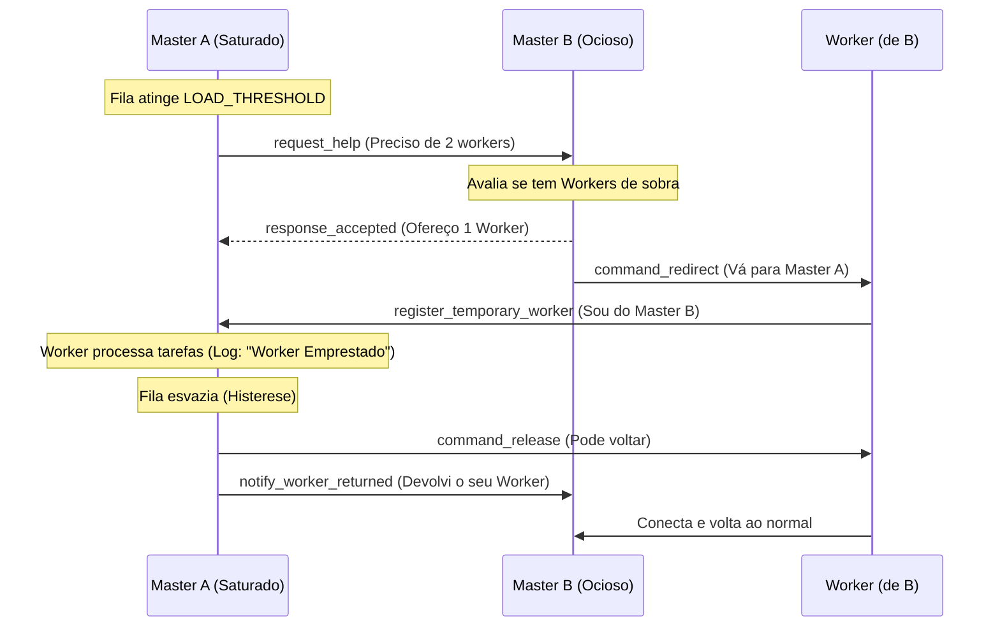

# Guia de Apresentação: Sprint 03 (P2P Master-to-Master)

Este guia foi desenhado para te ajudar a arrasar na apresentação. Ele mapeia exatamente a lógica que construímos no código, passo a passo, para que você possa apontar pro professor onde cada coisa acontece.

## 1. Visão Geral (O que fizemos?)

O objetivo da Sprint 03 é dar **Autonomia** ao sistema. Quando um Master (Mestre A) fica sobrecarregado de tarefas, ele conversa diretamente via Socket (P2P) com um Master Vizinho (Mestre B) pedindo ajuda. Se o vizinho tiver capacidade, ele **empresta** temporariamente um de seus Workers para o necessitado. Assim que a crise passa, o Worker é devolvido para casa.

### Diagrama de Sequência (O Fluxo de Vida)

---

## 2. Passo a Passo no Código (Onde mostrar pro professor)

### Passo 1: O Gatilho da Saturação (Master A)
> **Onde no código:** Arquivo `master.py` -> Função `p2p_server_loop()` (perto da linha 332)

O `p2p_server_loop` roda em background inspecionando a fila a cada segundo. Quando o número de tarefas pendentes atinge ou ultrapassa o `LOAD_THRESHOLD` (configurado como 5), ele dispara uma Thread chamando a função `ask_for_help()`.
> [!TIP]
> **O que falar:** "Nós usamos uma flag (Event) chamada `_help_in_progress` para garantir que o Master não fique flodando o vizinho com milhares de pedidos simultâneos enquanto já está esperando uma resposta."

### Passo 2: Pedindo Ajuda (Master A)
> **Onde no código:** Arquivo `master.py` -> Função `ask_for_help()`

Aqui o Master A se conecta na porta do vizinho, monta um JSON P2P (`request_help`) e envia pedindo `workers_needed: 2`.
Ele então espera no máximo 5 segundos por uma resposta.
> [!NOTE]
> **Casos de Teste Atingidos Aqui:**
> - **CT03:** Usamos um UUID único para o pedido (`request_id`).
> - **CT07 (Timeout):** Se o vizinho não responder, o bloco `except socket.timeout:` captura o erro e aborta a operação elegantemente.

### Passo 3: Avaliando o Pedido (Master B)
> **Onde no código:** Arquivo `master.py` -> Função `handle_help_request()`

Quando o vizinho recebe o pedido, ele avalia sua própria capacidade (`available_to_lend = max(0, len(workers) - 1)`). Ou seja, ele só empresta se puder continuar com pelo menos **1 Worker** para ele próprio.
- Se não tiver workers suficientes: Ele responde `response_rejected` com o motivo `high_load`. (**CT02 Coberto!**)
- Se tiver: Ele responde `response_accepted` e manda o Mestre A ficar tranquilo. Logo em seguida, ele manda a ordem de `command_redirect` para seus próprios workers.

### Passo 4: O Redirecionamento (Worker)
> **Onde no código:** Arquivo `worker.py` -> Função `handle_master_message()`

O Worker recebe o comando `command_redirect` do Master B. Ele extrai o endereço novo (ip e porta do Master A), altera seu alvo principal (`_redirect_target`) e dá um `return "redirect"`.
Isso quebra o loop atual dele, fazendo-o se conectar imediatamente na porta do Master A.
> [!IMPORTANT]
> **O que falar sobre Resiliência (CT08):** "Se durante a estadia no Master A a conexão cair, o socket do nosso Worker levanta um erro de rede, o try/catch interno é acionado, e ele sabe exatamente como voltar para a porta do Master original dele automaticamente."

### Passo 5: Apresentação Emprestada (Master A e Worker)
> **Onde no código:** Arquivo `worker.py` -> Função `build_presentation_payload()`

Ao se conectar no Master A, o Worker percebe que está "fora de casa" (o Master atual é diferente do Master Original). Em vez de mandar um `ALIVE` normal, ele envia o `register_temporary_worker`, e passa junto o **SERVER_UUID** de seu Master de origem. (**CT04 Coberto!**)
O Master A recebe isso (em `handle_worker`), salva o endereço original no dicionário protegido `borrowed_workers`, e nas próximas tarefas que ele executar, o log exibirá orgulhosamente: `Concluída por (Worker Emprestado)`. (**CT05 Coberto!**)

### Passo 6: A Devolução (Master A)
> **Onde no código:** Arquivo `master.py` -> Função `p2p_server_loop()` e `release_worker()`

Graças à **Histerese** (Nota de Implementação 35), o Mestre A não devolve o Worker logo em seguida (isso causaria um ping-pong). Ele espera a poeira baixar! O threshold de devolução é `pending == 0`.
Quando a fila zera, o `p2p_server_loop` chama a função `release_borrowed_workers()`. 
Nela, o Master A envia o `command_release` pro Worker voltar pra casa, e envia um pacote `notify_worker_returned` agradecendo o Master B.

---

## Detalhes Extras que rendem nota máxima

Se o professor tentar fazer "pegadinhas", mostre essas 3 proteções de engenharia de software que adicionamos no código base:
1. **Thread-Safety (Locks):** Toda vez que um dicionário de workers é modificado, usamos um `with workers_lock:` para que se múltiplos requests P2P ocorrerem no mesmo milissegundo, não haja concorrência/corrupção de memória. (Nota 38)
2. **Strict Parsing de P2P:** Adicionamos validação `if "request_id" not in p2p_msg:` logo na entrada do P2P. Se o professor enviar um pacote incompleto, o Master descarta mas continua vivo. (Nota 31)
3. **Robustez P2P:** Todos os tipos de JSON são filtrados com `.lower()`, o que nos torna imunes a falhas de digitação do Master vizinho. Se enviarem um P2P desconhecido, o sistema cai num bloco `else` seguro e apenas "ignora" amigavelmente (CT09).
